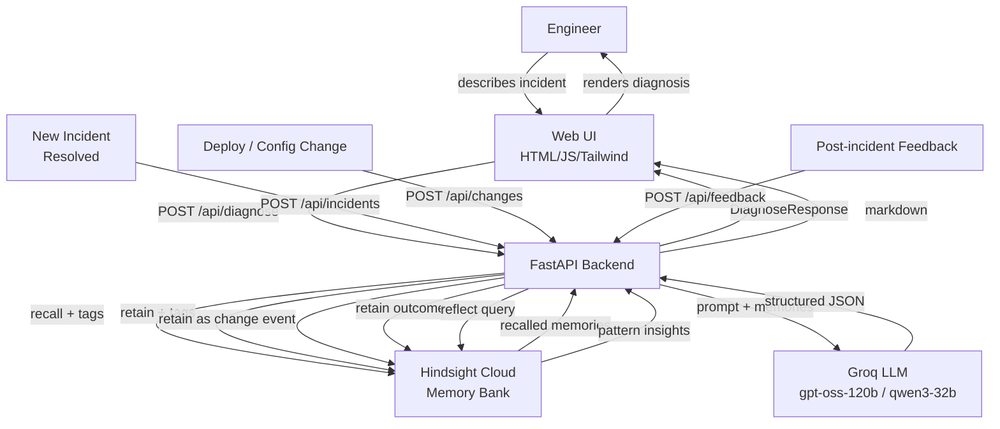

# Recall – Incident Debugging Agent with Persistent Memory

**A Technical Whitepaper**

*Author: [Your Name]*
*Date: 2025*
*Version: 1.0*

---

## Executive Summary

Production incidents are expensive – not because they happen, but because we keep relearning the same lessons. When a database timeout hits the payments service at 2 AM, the on-call engineer spends 30–45 minutes searching Slack threads, stale runbooks, and old JIRA tickets to reconstruct what happened last time. Then they fix it, write a postmortem, and the institutional knowledge lives in a document that nobody reads until the next incident.

**Recall** is an AI-powered incident debugging agent that eliminates this cycle. It uses **Hindsight** (by Vectorize) as a long-term memory layer, retaining every incident with its root cause, resolution, and prevention notes. When the next incident hits, the agent searches memory, surfaces the most relevant past cases, and delivers a structured diagnosis: root cause, ranked checklist, precursor detection, and confidence level – all grounded in real past incidents, never fabricated.

The before/after contrast is stark: without memory, an LLM gives generic advice ("check your database connections"). With Recall's memory, it says: *"We've seen this 4 times before. Last time it was RDS at 95% CPU from an unoptimized query. Fix: kill the long-running query and add a composite index. Prevention: CPU alert at 80%."*

---

## 1. The Problem

### 1.1 The Incident Knowledge Gap

When production systems fail, engineering teams lose significant time to a predictable ritual: searching logs, Slack, old tickets, and postmortems for the answer to "have we seen this before?" Root causes recur. The same configuration mistake triggers the same cascade. The same query causes the same RDS CPU spike. But without a system that remembers, every incident feels new.

**Estimated cost (illustrative assumption, not a measured result):** For a 500-person engineering organization experiencing approximately 50 incidents per year, each requiring 30–45 minutes of context-gathering before diagnosis, the overhead is roughly **1,200–1,875 engineer-hours annually**. This is a rough estimate based on reasonable assumptions about team size and incident frequency; your organization's numbers may differ significantly.

### 1.2 Why Existing Tools Fall Short

| Tool | What it Does | What it Misses |
|---|---|---|
| Runbooks | Captures known fixes | Stale; not searchable by symptom |
| Postmortems | Documents root causes | Narrative format; hard to query |
| Monitoring/APM | Alerts on metrics | Doesn't correlate with past events |
| Plain LLM chat | Generic advice | No access to your incident history |
| Ticket systems | Tracks incidents | Full-text search only; no reasoning |

The gap is a **reasoning layer** that can search institutional memory and apply it to the current incident in real time.

---

## 2. The Solution: Recall

Recall is a three-layer system:

1. **Memory Layer** – Hindsight (by Vectorize) stores every incident as a structured, searchable memory
2. **Reasoning Layer** – Groq LLM synthesizes recalled memories into actionable diagnosis
3. **Experience Layer** – Post-incident feedback updates memory so the system improves with use

### 2.1 Key Capabilities

| Capability | Description |
|---|---|
| **Ingest** | Accept incidents via UI form, JSON upload, or REST API |
| **Change Events** | Track infra/deploy changes as precursor signals |
| **Diagnose** | Natural-language query → structured diagnosis with memory citations |
| **Precursor Detection** | Correlates recent change events with current symptoms |
| **Feedback Loop** | "This fix worked/didn't work" updates future recommendations |
| **Pattern Insights** | Hindsight reflect surfaces recurring root causes and risky services |
| **Memory Toggle** | Side-by-side comparison: LLM alone vs. LLM + Hindsight memory |

---

## 3. Architecture



### 3.1 Component Roles

| Component | Role |
|---|---|
| **FastAPI** | REST API, request validation (Pydantic), CORS, static file serving |
| **Hindsight Cloud** | Long-term memory: retain, recall, reflect operations |
| **Groq** | LLM reasoning over recalled memories; JSON-structured output |
| **Frontend SPA** | Single-page app (Tailwind CDN); dark/light mode; memory toggle |
| **Pydantic Models** | Input validation and structured schema enforcement |

---

## 4. How Hindsight Memory is Used

This is the most important section of this document. Hindsight is not used as a keyword search index or a simple vector store. It is used as an **intelligent memory system** that understands context, time, and relationships between events.

### 4.1 Memory Bank

A single Hindsight memory bank (`recall-incidents`) stores all incident memories with a configured mission:

> *"You are an expert incident-response analyst. Store and retrieve production incident records, change events, root causes, resolution steps, and prevention recommendations. Surface patterns, precursors, and lessons learned."*

**Why one bank?** Incidents and change events need to be recalled together so the agent can surface precursor correlations ("this config change was followed by this error 2 hours later"). A single bank with tags for type, service, and severity allows flexible filtering without siloing.

### 4.2 Retain (Memory Storage)

Every time an incident is ingested:

```python
client.retain(
    bank_id="recall-incidents",
    content=structured_incident_text,      # rich narrative
    timestamp=incident.timestamp,          # temporal indexing
    document_id=sha256(title + timestamp), # idempotency
    metadata={"severity": "P1", "type": "incident"},
    tags=["severity:P1", "service:payments-api", "type:incident"],
)
```

**Design choices:**
- `document_id` is a deterministic hash of title + timestamp, making ingest **idempotent** (safe to re-run)
- `tags` enable filtered recall (e.g., only P1 incidents for a specific service)
- `metadata` stores structured key-value pairs for downstream filtering
- `timestamp` enables Hindsight's temporal retrieval to surface incidents from a relevant time window
- Secrets are **redacted** from content before storage (API keys, tokens, emails, IPs)

### 4.3 Recall (Memory Retrieval)

When an engineer asks a question:

```python
response = client.recall(
    bank_id="recall-incidents",
    query=engineer_query,        # natural language
    max_tokens=4096,
    budget="mid",
    tags=service_filter_tags,    # optional service-scoped filter
    tags_match="any",
)
```

Hindsight returns a ranked list of `RecallResult` objects, each containing:
- `id` – stable memory identifier
- `text` – the memory content
- `tags` – associated tags (used to show citations in UI)
- `occurred_start` – temporal reference
- `metadata` – structured fields

**Why not just use the LLM directly?** Without recall, the LLM has no knowledge of your specific incidents. It can only offer generic advice. With recalled memories as context, it can make specific, cited claims: *"Memory mem-abc shows this happened on 2024-02-15 with root cause X."*

### 4.4 Reflect (Pattern Analysis)

For the Patterns dashboard:

```python
response = client.reflect(
    bank_id="recall-incidents",
    query="Analyse all stored incidents. Surface recurring root causes...",
    budget="mid",
    include_facts=True,
)
```

`reflect` is fundamentally different from `recall`. While `recall` returns raw memory results for the caller to reason over, `reflect` **reasons over memory internally** and returns a synthesized narrative. This is used for the Patterns view, which shows recurring root causes, riskiest services, and common precursors – things that require synthesis across many memories, not just retrieval.

**Why `budget="mid"` for patterns and `budget="mid"` for recall?**
- `low` is fast but shallow – appropriate for quick lookups
- `mid` balances depth and latency – appropriate for diagnoses and patterns
- `high` is deep but slow – not needed given our incident memory sizes

### 4.5 Memory Tags and Why Each Was Chosen

| Tag Pattern | Example | Purpose |
|---|---|---|
| `severity:P1` | `severity:P1` | Filter/prioritize high-severity incidents |
| `service:payments-api` | `service:payments-api` | Scoped recall for service-specific queries |
| `type:incident` | `type:incident` | Distinguish incidents from change events and feedback |
| `type:change_event` | `type:change_event` | Retrieve change events for precursor correlation |
| `fix_style:rollback` | `fix_style:rollback` | Learn team fix preferences over time |
| `source:kaggle` | `source:kaggle` | Track data provenance |

### 4.6 Feedback Loop – Learning from Outcomes

After an incident is resolved, engineers submit feedback:

```python
# "This fix worked" is retained as a new memory
client.retain(
    bank_id="recall-incidents",
    content="FEEDBACK ON INCIDENT: DB timeout\nFix worked: Yes\n...",
    tags=["type:feedback", "fix_worked:true", "fix_style:proper_fix"],
)
```

Future `recall` calls for similar incidents will surface both the original incident memory **and** the feedback memory. This means the LLM can reason: *"The last time this happened, a quick patch was tried (feedback: didn't work), and the proper fix (adding an index) worked on the second attempt."*

This creates a genuine learning loop – not just storing facts but storing **outcomes**.

---

## 5. Data Model and Memory Schema

### 5.1 Incident Memory Schema

```
INCIDENT: {title}
Timestamp: {ISO 8601}
Severity: {P1|P2|P3|P4}
Affected services: {comma-separated}
Error messages: {redacted}
Stack trace: {redacted}
Duration: {minutes}
Root cause: {text}
Resolution steps: {numbered list}
Prevention notes: {text}
Fixed by: {name}
Fix style: {quick_patch|proper_fix|rollback}
```

Metadata (key-value, string only): `severity`, `fix_style`, `source`, `type`, `services`, `fixed_by`, `duration_minutes`

### 5.2 Change Event Memory Schema

```
CHANGE EVENT: {title}
Type: {deploy|config|infra|dependency|other}
Timestamp: {ISO 8601}
Description: {text}
Affected services: {comma-separated}
Author: {name}
```

### 5.3 Feedback Memory Schema

```
FEEDBACK ON INCIDENT: {title}
Fix worked: {Yes|No}
Fix style: {type}
Confirmed root cause: {text}
Notes: {text}
```

---

## 6. Data: Sources, Attribution, and Field Disclosure

### 6.1 Kaggle Incident Event Log Dataset

- **URL**: https://www.kaggle.com/datasets/winmedals/incident-event-log-dataset
- **Format**: CSV, ITSM event log (multi-row per incident, one row per state change)
- **License**: Verify on Kaggle page before redistribution. Raw CSV is excluded from repo.
- **Attribution**: Winmedals, Kaggle, 2025.

The ingest script (`scripts/ingest_kaggle.py`) collapses the multi-row event log to one record per incident using the incident number as key.

### 6.2 Field Origin Disclosure

| Field | Origin |
|---|---|
| Incident ID, timestamps, category, service, resolver | `source="kaggle"` – original values unchanged |
| **error_messages, root_cause, resolution_steps, prevention_notes, fix_style** | `source="synthetic_enrichment"` – **LLM-generated**, grounded in real category/service/closure code |

**Synthetic fields are clearly labeled.** They are illustrative only and are never presented as real incident history in any UI or report.

### 6.3 Curated Demo Dataset

- **File**: `data/curated_incidents.json`
- **Source**: Hand-authored, entirely fictional, MIT licensed
- **Contains**: 11 incidents, 4 change events; demo storyline with DB timeout recurring pattern
- **Marked**: `source="curated_demo"` in all metadata

---

## 7. Demo Walkthrough: Before and After Memory

### 7.1 The Query

*"Connection timeout on DB write. PostgreSQL write operations are hanging on the payments-api service."*

### 7.2 Without Memory (Plain LLM)

> **Root Cause Hypothesis**: Database connection pool exhausted or network timeout between application and database server.
>
> **Recommended Fix**: Check database connection pool configuration. Verify network connectivity. Consider increasing pool size or connection timeout.
>
> **What to Check First**: 1. Database server health. 2. Connection pool metrics. 3. Network latency. 4. Application logs.
>
> **Confidence**: Low (20%) — "No match"

*Generic, untargeted, requires the engineer to start from zero.*

### 7.3 With Recall Memory (Hindsight-powered)

> **Have we seen this? Yes – 4 times (2024-02-15, 2024-04-03, 2024-06-19, 2024-09-11)**
>
> **Root Cause Hypothesis**: RDS CPU spike to 90–97%, most likely caused by a long-running unoptimized query or missing index. Check for recent deploys (last 2 hours) that touched `payments_transactions` or related tables.
>
> **Recommended Fix**:
> 1. Check `pg_stat_activity` for queries running > 30 minutes
> 2. Kill long-running query: `SELECT pg_terminate_backend(pid) WHERE query_start < NOW() - INTERVAL '30 min'`
> 3. If a recent deploy introduced a new query, roll back the feature flag
>
> **Possible Precursors**: v3.1.2 fraud-detection deploy (2024-06-19), missing index on fraud_signals table.
>
> **Prevention**: RDS CPU alert at 80%. Require EXPLAIN ANALYZE review for all queries on tables > 1M rows.
>
> **Confidence**: High (92%) — based on 4 recalled memories

[SCREENSHOT: side-by-side comparison panel]

*Specific, cited, actionable – and the engineer didn't have to search anything.*

---

## 8. Engineering Quality

### 8.1 Error Handling

| Scenario | Handling |
|---|---|
| Hindsight API down | `get_hindsight()` returns `None`; all service functions degrade gracefully |
| Groq rate limit (429) | Exponential backoff (1s, 2s, 4s) before retrying |
| Primary LLM failure | Automatic fallback to `qwen/qwen3-32b` |
| LLM returns invalid JSON | Regex extraction from markdown fences; empty dict fallback |
| Empty memory bank | Diagnosis proceeds with `with_memory=False` behavior |
| Malformed input | Pydantic validation returns 422 with field-level error details |

### 8.2 Security and Redaction

Before any content is stored in Hindsight:

```python
# Patterns scrubbed:
# - API keys, tokens, passwords (regex on key=value patterns)
# - Email addresses
# - IPv4 addresses
# - Groq-style keys (gsk_...)
# - OpenAI-style keys (sk-...)
```

This prevents accidentally storing secrets from pasted stack traces or error logs.

### 8.3 Testing

| Test Suite | Coverage |
|---|---|
| `TestRedaction` | 6 tests – secret patterns, email, IP, normal text passthrough |
| `TestIncidentSchema` | 8 tests – validation, service normalization, defaults |
| `TestMemoryService` | 7 tests – retain success/failure, recall, idempotency |
| `TestLLMService` | 6 tests – fallback, JSON parse, markdown extraction, prompts |
| `TestAgent` | 3 tests – full diagnose pipeline, memory toggle, confidence clamp |
| `TestKaggleIngest` | 4 tests – column cleaning, priority mapping, timestamp parsing |

**Total: 35 tests, all passing.**

---

## 9. Deployment

- **Platform**: Hugging Face Spaces (Docker), free tier
- **Live URL**: `[LIVE URL PLACEHOLDER – add after deployment]`
- **Memory backend**: Hindsight Cloud (no self-hosting required)
- **Cold starts**: Handled with a "Waking up…" banner and polling until server responds

See `DEPLOY.md` for step-by-step deployment instructions, platform secrets setup, and git workflow.

---

## 10. Limitations and Honest Lessons Learned

### 10.1 LLM Hallucination Guardrail is Prompt-Level Only

The current approach instructs the LLM not to fabricate incidents, but does not verify that every claim traces to a specific `memory_id`. A more robust approach would add a citation-checking post-processing step. This is a known limitation.

### 10.2 Hindsight Recall Quality Depends on Memory Richness

If incidents are stored with minimal detail (title only, no root cause or error messages), recall quality drops significantly. The system is only as good as what engineers put into it. The UI and API prompts encourage rich incident details, but this is a cultural/process challenge, not a technical one.

### 10.3 Free Tier Constraints

Both Groq free tier and Hindsight free tier have rate limits. Under high concurrent usage (e.g., multiple engineers running compare operations simultaneously), users may experience delays. The retry logic handles this, but the delay is noticeable. A production deployment should use paid tiers.

### 10.4 Kaggle Dataset Limitations

The Kaggle Incident Event Log Dataset is an ITSM event log, not a technical incident log. It has no error messages or stack traces. The LLM-generated enrichment fields are illustrative only and clearly labeled as synthetic. The curated demo dataset is more representative of real technical incidents.

---

## 11. Roadmap

| Priority | Feature | Description |
|---|---|---|
| P1 | Slack integration | Ingest incidents from Slack channels automatically |
| P1 | PagerDuty webhook | Auto-ingest PD alerts and link to resolved incidents |
| P2 | Datadog integration | Pull runbook links and metric context into diagnoses |
| P2 | Auto-ingest postmortems | Parse Google Docs / Notion postmortems via API |
| P2 | Multi-bank tenancy | Separate memory banks per team or product area |
| P3 | Semantic deduplication | Detect near-duplicate incidents before retaining |
| P3 | Confidence calibration | Measure actual accuracy of high-confidence predictions |
| P3 | Alert → incident auto-trigger | When a PD alert fires, pre-run diagnosis automatically |

---

## 12. Setup Instructions

### Quick Start (Local)

```bash
# 1. Clone
git clone https://github.com/YOUR_USERNAME/recall.git
cd recall

# 2. Install deps
pip install -r requirements.txt

# 3. Configure
cp .env.example .env
# Edit .env: add HINDSIGHT_API_KEY and GROQ_API_KEY

# 4. Run
uvicorn app.main:app --reload

# 5. Open
open http://localhost:8000
```

### Get API Keys

| Service | URL | Notes |
|---|---|---|
| Hindsight | https://ui.hindsight.vectorize.io | Use promo code **MEMHACK99** for $50 credits |
| Groq | https://console.groq.com | Free tier, no credit card required |

### Repository

`https://github.com/haleemaasadiya01/recall`

---

*This document was produced as part of the Recall project, a demonstration of AI-powered incident memory using Hindsight (Vectorize) and Groq. All cost estimates are illustrative assumptions. All Kaggle-derived synthetic fields are clearly labeled. Curated demo data is entirely fictional.*
